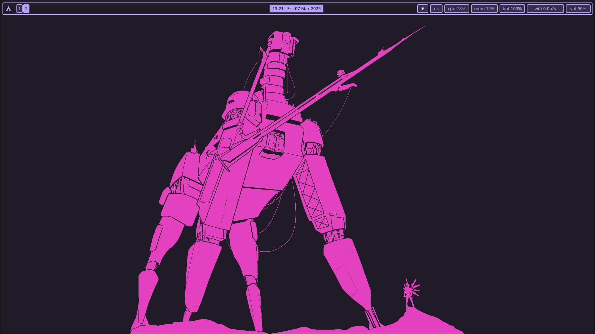
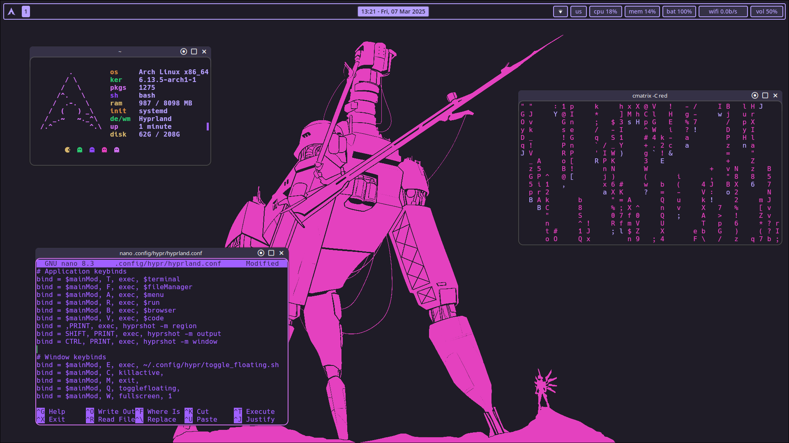
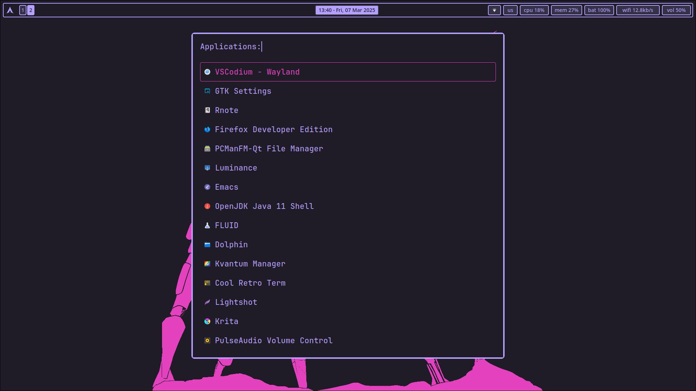

# .dotfiles
My dotfiles repo. Contains files for my Hyprland setup and my LXQt setup, as well as some applications
# Hyprland

## Machine

## Matrix

### Waybar config based on [MubinMuhammad's config](https://github.com/MubinMuhammad/MinimalSwayFX/tree/main/waybar)

