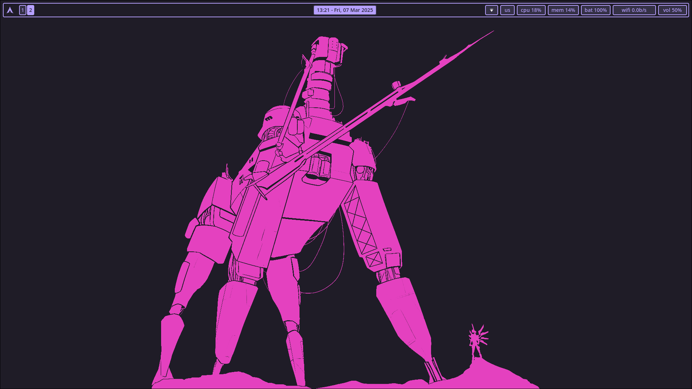
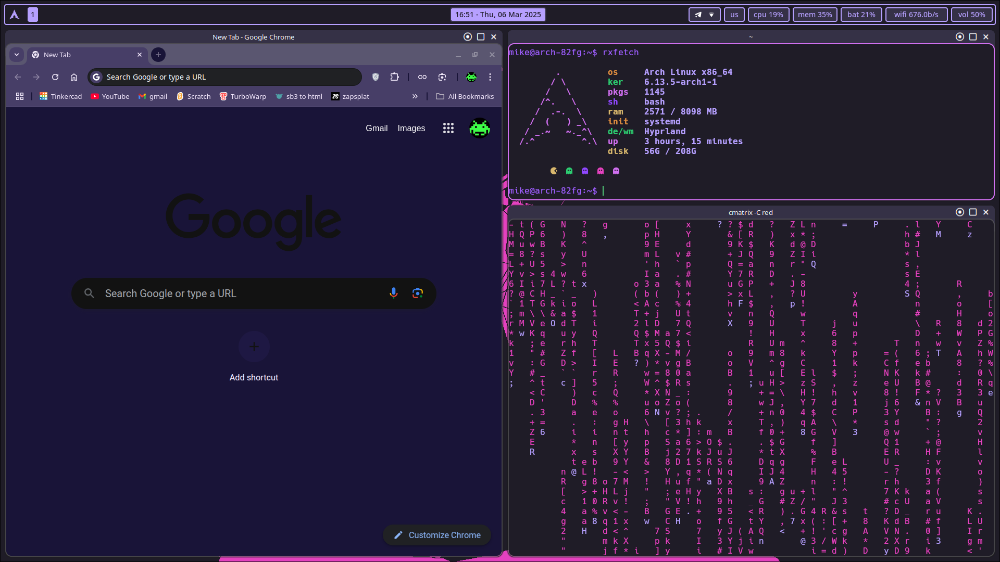
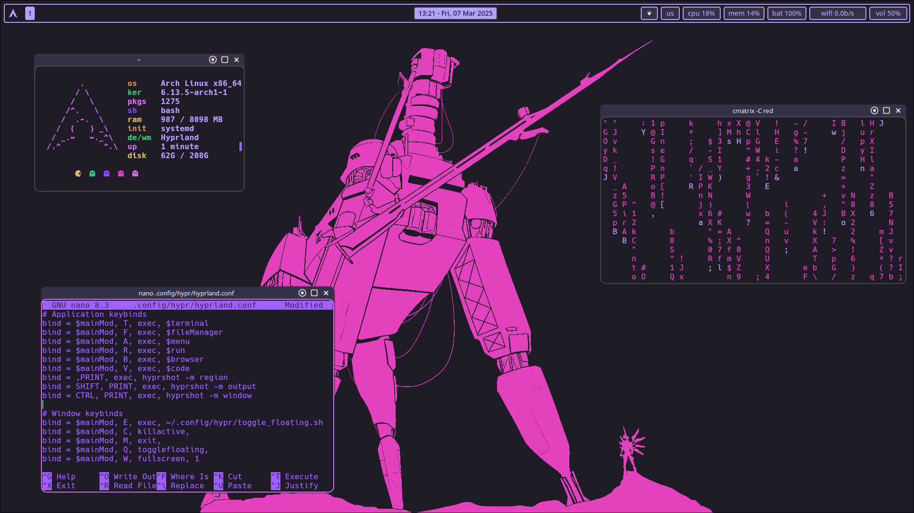
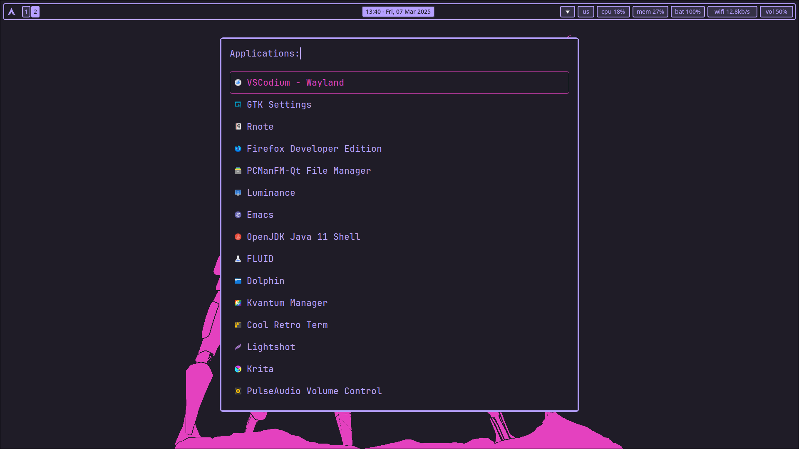

# .dotfiles
My dotfiles repo. Contains files for my Hyprland setup and my LXQt setup.
## Hyprland

## Waybar config based on [MubinMuhammad's config](https://github.com/MubinMuhammad/MinimalSwayFX/tree/main/waybar)
