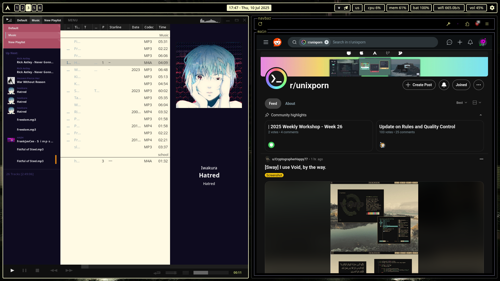
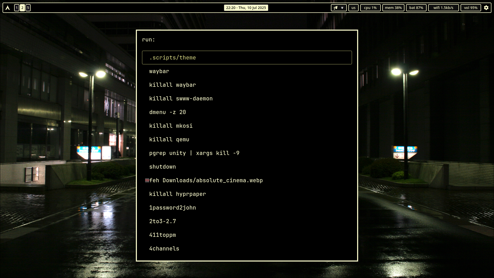

# .dotfiles
My dotfiles repo. Contains files for my Hyprland setup and my LXQt setup, as well as some applications.

## WARNING:
DO NOT RUN hypr/.config/hypr/hypr_theme.sh (it will try to remove your configs for most programs in this repo and replace them with mine). I will rework it and add an installation script soon.

Until then all configs that require separate theme files are broken by default, you'll have to symlink theme files by hand if you REALLY want to use those configs.

Currently broken configs:

 - alacritty
 - firefox
 - hypr
 - kitty
 - rofi
 - waybar
 - kitty_theme_hypr script (redundant anyway, unless you use multiple DEs/WMs)
 - wezterm

***

Hyprland

<ul>
<li>

 

Hyprland

### Machine

### Matrix

### Night

### Zen

</li>
<li>

Waybar

### Config based on [MubinMuhammad's config](https://github.com/MubinMuhammad/MinimalSwayFX/tree/main/waybar)

</li>
</ul>
